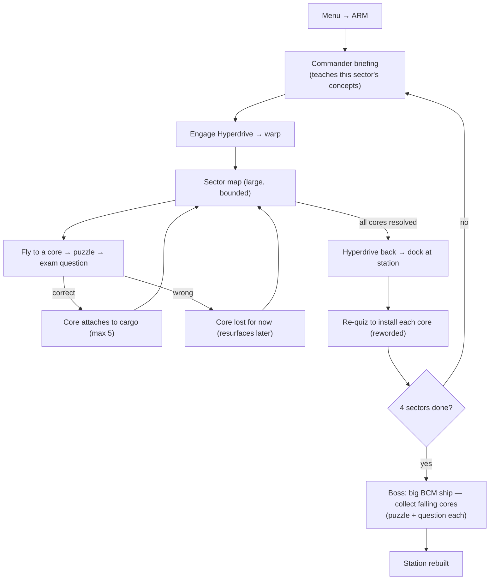

# 02 — ARM · Acropolis Rescue Mission

<!-- doc-version: v1.6 · baseline v1.0 = original file · MINOR (s3D puzzles: DECRYPT + TRACE shipped, tier-gated) -->
**Doc version:** v1.6 · **Owner:** single chat · **Edited:** 2026-07-12
**Change vs v1.5:** two of s3D's wanted puzzles are SHIPPED (`v0.176.0`): **DECRYPT** (4-glyph mastermind vs the stability timer, 32s budget, T2-only) and **TRACE** (node-conduit maze, solvable by construction like rewire, 24s, T1+). Rosters are tier-gated: T0 = the classic six, T1 adds trace, T2 adds decrypt AND deals the hard half (decrypt/trace/rewire/vcpu) first. 'Timed debris' remains unbuilt.
**Change vs v1.4:** §3D's difficulty-shape toggle is SHIPPED (`v0.155.0`): "Smooth difficulty" in ARM Settings (default ON, persisted `armSmoothDiff`). ON = enemy HP arrives as a per-sector spawn-population MIX at tier entries (sector 5/9: 40% new-tier, next sector 70%, then 100%) and shot damage LERPS 10→18 across all 12 sectors (max +1/sector); OFF = the classic hard tier steps. Boss weakpoint HP and question bands stay tier-stepped by design.

**Genre:** 2D flight + collect (Canvas). **Status:** ~80% built as the standalone `starnix.html`; this phase **ports it into a module** under the shared core and adds the remaining content (4 sectors + boss).

The name nods to Nutanix **Acropolis** (AHV/AOS). Goal: recover the station's scattered cores and rebuild it.

---

## 0. Build status (added v1.1)

| Increment | Scope | State |
|-----------|-------|-------|
| **1** | Module port of the existing single-sector game to the contract: `registerGame`/`mount`/`unmount`, `ctx` wiring (questions/mastery/audio/rng/theme/telemetry/persistence), deterministic RNG, object-pooled projectiles/particles, no cinematic/title, a11y cues, clean unmount. | ✅ **done — jsdom harness green (67/67)** |
| **2** | New content per §3B/§3C: 4 data-driven sectors, lost-core resurfacing, boss; extend harness to the full 4-sector+boss playthrough. | ⏳ next |
| **3** | Optional polish (§3D): more puzzle types, minimap, codex, difficulty-shape toggle. | later |

Deliverables for Increment 1: `arm.js` (the module — the only file the Core chat needs), `arm-test.html` + `mock-core.js` + `arm-harness.mjs` (test-only stand-ins/verification, **not** shipped in the build).

---

## 1. Flow (target)

Per your spec: ship holds **5 cargo**; each core requires a **puzzle + exam question** to pick up; on return you **re-answer to install**; after **4 sectors** comes the **boss** where cores fall off the big ship and must be collected (puzzle + question).

> **Increment-1 note:** the single ported sector implements briefing → warp → sector → (puzzle/combat + collect question) → warp home → install re-quiz → debrief/shop. The "4 sectors" gate and the boss are Increment 2; the install re-quiz currently re-asks the **same** authored question per core (see Open decisions D1).

---

## 2. Already built (in `starnix.html`) — to port

- Title, skippable Disruptor cinematic, how-to.
- Briefing (bottom-right commander portrait + paced dialogue).
- Warp transition + layered hyperdrive SFX.
- One large bounded sector; camera follows; ship-mounted compass to nearest core.
- Per-core challenge: puzzles (**Simon**, **rewire** grid pipe-routing with BFS-validated solvability, **dials**) and combat tasks (**clear drones**, **shatter asteroid**).
- Exam question on pickup; correct → core attaches and ship grows/handles heavier; wrong → core hidden.
- Enemies that chase + fire; shields with **recharge after 4s**; **no idle respawn**; **3-enemy wave per core**; destructible **fragmenting asteroids**.
- Return **hyperdrive → navigable home view → dock at the MCI Station → re-quiz install** (station visibly grows per install).
- Shop (consumables + upgrades, level pips); scoped game-over (reset sector, drop a couple upgrade levels, keep coins/installed station).
- SID-style chiptune + SFX, toggleable.
- Headless jsdom playthrough harness (currently 47 assertions green).

> **Ported in Increment 1:** all of the above except the **title + cinematic** (now owned by the shell) and the **built-in audio engine** (now `ctx.audio`, extracted to core per `01 §7`). The commander portrait is kept (original in-code art). The headless harness was re-implemented against the module + `ctx` mock (now **67 assertions green**).

---

## 3. Changes required to integrate + finish

**A. Modularize (Phase 1 core port)**
- [x] Wrap as a `GameModule` (`mount/unmount`); return cleanly to menu (cancel RAF, drop listeners). *(v1.1 — verified: leak check green; root emptied; seam removed.)*
- [x] Replace inline `CONCEPTS` with the shared **QuestionProvider** (sector → `domain`). *(v1.1 — `ctx.questions.next({game,domain,difficultyBand,excludeIds,rng})`.)*
- [x] Route every answer through **MasteryStore** (this is currently game-local). *(v1.1 — `ctx.mastery.record(id,correct,{game:'ARM'})` on every collect + install; verified.)*
- [x] Use shared **Audio**, **theme tokens**, **RNG**, **PersistenceProvider**, **Telemetry**. *(v1.1 — all consumed from `ctx`; persistence is optional/best-effort; telemetry emits `question_answered` + `run_ended`.)*
- [x] Move the intro cinematic to the **shell** (shared); ARM starts at the **briefing**. *(v1.1 — module mounts at BRIEF; no title/cinematic/wordmark in the module.)*

**B. Multi-sector content (the "4 sectors" requirement)** — *Increment 2*
- [ ] Data-driven sectors: a sector = `{ domain, coreLayout, puzzleAssignments, difficultyBand, briefingScript }`.
- [ ] 4 sectors mapped to 4 exam domains; per-sector difficulty curve.
- [ ] Briefing script generated from each concept's `briefing` field (optionally rephrased by `AIAdapter`). *(v1.1 — already generated from `q.briefing` for the single sector.)*
- [ ] Carry coins/upgrades/mastery across sectors within a run.
- [ ] "Lost" cores resurface in a later sector (the hidden pool). *(v1.1 — plumbing present: collect-fails are gathered per attempt and committed on home; pool **consumption** is Increment 2.)*

**C. Boss sector (after sector 4)** — *Increment 2*
- [ ] Big BCM ship with multiple hit phases; on phase break it **sheds cores**.
- [ ] Each shed core: fly to it → puzzle → exam question → install.
- [ ] Boss attack patterns (telegraphed); uses shields/ammo economy already in place.
- [ ] Win state = station fully rebuilt for this pack; record best + mastery.

**D. Carried-over M2/M3 polish (optional, from prior StarNix backlog)** — *later*
- [ ] More puzzle types (mastermind decrypt / node-trace maze / timed debris).
- [ ] Minimap option.
- [ ] Codex / ship's-log to re-read briefings outside combat.
- [ ] Difficulty-shape toggle (gentle ramp vs uniform).

---

## 4. Brand rule (carry into shared theme)

Use **original neon Nutanix-styled art** drawn in code. The **official Nutanix wordmark** (white SVG) appears **unaltered, title screen only** — never recolored or distorted (brand guideline). All in-game iconography is original.

> **Increment-1 compliance:** the module contains **no wordmark** at all (the title screen is the shell's); ARM's in-code art (ship, station glyph, cores, drones, asteroids, commander portrait) is original and unchanged. Palette comes from `ctx.theme` with the doc-08 fallbacks.

---

## 5. Test/verification additions

- [ ] Port the existing playthrough harness to **Vitest + jsdom**; keep it green. *(v1.1 — ported to a **jsdom** harness (`arm-harness.mjs`, green); Vitest packaging deferred to the `05` test-infra work.)*
- [ ] Extend it to a full **4-sector + boss** playthrough (state transitions, install accounting, mastery writes). *(Increment 2.)*
- [x] Assert clean unmount (no leaked listeners/RAF) when returning to menu. *(v1.1 — listener/timer/RAF counts return to zero; root emptied; remount verified.)*
- [ ] Question integrity covered by the shared validator (no ARM-specific keys). *(Owned by `01`/`06`; ARM authors no question keys — it only reads `ctx.questions`.)*

**Increment-1 harness coverage (67 assertions):** full single-sector playthrough + state-machine transitions; install accounting (`stationBuild`); mastery writes (per-id record counts + summary); telemetry (`question_answered` ×10 + `run_ended:win`); RNG determinism (same seed → identical draws); wrong-answer → core lost + incorrect recorded; clean unmount; remount.

---

## 6. ARM checklist (rollup)

**Port**
- [x] GameModule wrapper + clean unmount
- [x] Shared QuestionProvider / MasteryStore / Audio / theme / RNG / persistence / telemetry
- [x] Cinematic moved to shell

**Content** — *Increment 2*
- [ ] 4 data-driven sectors (domains + curves + briefings)
- [ ] Lost-core resurfacing pool
- [ ] Boss sector with shed-core collection

**Polish (optional)** — *later*
- [ ] ~~New puzzle types~~ (DECRYPT + TRACE shipped `v0.176.0`; 'timed debris' still open) · minimap · codex · ~~difficulty-shape toggle~~ (shipped `v0.155.0`)

**Verification**
- [ ] Vitest playthrough (4 sectors + boss) green  *(jsdom single-sector playthrough green; full + Vitest pending)*
- [x] Unmount leak check green

---

## 7. Open decisions (added v1.1)

These were defaulted to keep Increment 1 moving; flagged for the owner / Core chat to confirm before Increment 2 hard-codes them.

- **D1 — install re-quiz sourcing.** §1 says re-quiz to install "reworded." The shared bank is **domain-keyed** and authored-only (no AI), so faithful per-concept rewording isn't available without authored paired variants (a `06` concern) or AI (forbidden by `00 §1`). **Default:** install re-asks the **same** authored question id the core carried (a genuine second spaced retrieval; advances the Leitner bucket). **Alternative:** draw a *different* question from the same domain. *Confirm which.*
- **D2 — settings source.** `01` lists reduced-motion/extra-time but `ctx` defines no settings field. **Default:** ARM reads `ctx.settings` if present, else local toggles in its own menu, and best-effort persists via `ctx.persistence`. *Confirm whether the shell will own a shared settings object on `ctx`.*
- **D3 — menu-return handshake.** `01 §9` defines no completion callback. **Default:** ARM calls optional `ctx.exit?.()` from its in-game menu / debrief to request return; standalone falls back to restart. *Confirm the shell provides `exit` (or a back control + `unmount`).*
- **D4 — perf exception.** Per-frame churn (bullets/enemy-bullets/particles) is object-pooled per `01 §13`. **Asteroid fragmentation** allocates new rock objects, but only on the discrete "asteroid destroyed" event (not steady-state). Flagged as a reviewer-confirmed exception; can be pooled in Increment 2 if the review agent requires it.
- **D5 — SFX name set.** ARM emits `fire/hit/explode/collect/correct/wrong/hyperdrive/click`. `01 §7` lists all but `click`. *Confirm the extracted audio engine maps `click` (else it harmlessly no-ops).*

## 8. Sprites, hyperdrive, and the intro cinematic (added v1.2)

ARM is asset-gated: each sprite is drawn from `ctx.assets` (inlined `STARNIX_ASSETS`) with an in-code **vector fallback** if the key is absent, so the module still runs standalone. `SPR = { hero, enemy, boss, warp, dive, station }`, loaded in `initSprites`:

| Slot | Asset key | Role |
|---|---|---|
| `hero` | `armHero` | the player's ship, in-game (top-down; rotates with heading) |
| `enemy` | `armEnemy` | the in-game BCM fighter (silver-grey/red); rotates to face the player |
| `boss` | `armBoss` | boss hull (Increment-2 seam; encounter not yet built) |
| `warp` | `armWarp` (else `ccShip`) | dead-astern hull shown during the hyperdrive cutscene |
| `dive` | `armEnemyDive` | near-black BCM enemy used **only** in the intro dive-to-planet beat |
| `station` | `armStation` | the intact Acropolis Station, shattered in the intro |

**Hyperdrive warp** (`startWarp`): a 3-2-1 countdown ("spinning up") then an accelerating 3D star-streak tunnel. The `armWarp` hull rides the streak with its nozzles anchored low on screen; its length eases **+10% forward** as the jump spins up, holds through the tunnel, then eases back to normal as it **punches out** (white flash). Reduced-motion drops the stretch and the streaks.

**Intro / Disruptor cinematic** (P6a — `playIntro` / `updateIntro` / `drawIntro`, the `INTRO` state). Plays **once at campaign start** (`newRun → startBriefing → playIntro`); later sectors skip straight to the briefing. Skippable (a Skip button; the cutscene also auto-ends). Beats: warp-arrival streaks → the `armStation` sprite fades in intact → the BCM **Disruptor** charges (top-right) and fires a beam into it with a white impact flash → the station **shatters into a 3×3 grid of sprite fragments** while its knowledge cores scatter as glowing orbs → a **dive-to-planet** beat where a planet rises and the player dives toward it alongside `armEnemyDive` BCM enemies. Captions narrate each beat; a vector citadel (hex + spire) stands in if `armStation` hasn't decoded. ~7.2 s (4.6 reduced).

> **Supersedes** the v1.1 note in §3 that "the intro cinematic moved to the shell": the **shell** owns the title screen; **ARM** owns this campaign-start Disruptor cutscene. The whole sequence is browser-blind (the headless harness early-returns the canvas), so it carries a visual-pass debt.

---

## 9. Feel pass, the real planet, and Session-3 systems (added v1.3 — matches shipped `arm.js`)

**Feel pass (`v0.44.0`, review items A1–A5).** The starfield is a **4-layer parallax** field including a FOREGROUND layer that streams *over* the ship; speed star-streaks fade in above ~140 spd. The hull **banks** on turns with the wingspan foreshortening (`shipBank`, eased at `dt*7`) and the world **counter-rolls** slightly (0.045). The camera **leads velocity** (~0.35) with a springy settle and stays tight/lead-free in the home view. Occluder rocks (A-item candidate) were scoped out — they obscure question reads.

**The real planet (`v0.47.0`).** The campaign-intro **dive beat** now draws the actual `planet` image (circular `arc` clip; `SPR.planet = loadSprite(A.planet)`), with the old procedural gradient kept only as the decode fallback. Scope correction for the record: the SHELL's cold-open cinematic never lost its planet — the asset was valid, wired, and drawn throughout; the gap was ARM's intro beat only, which had never used the image. A gate pin keeps it kept.

**Session-3 systems (shipped earlier, documented here).** The warp is a **3D wormhole hyperdrive** visual; collecting the final core triggers a **full-collection escape gauntlet** (timed escape run to the exit); the puzzle roster is **Simon / Battery / vCPU** (Grid removed); `pause()`/`resume()` freeze hard behind the shell overlay with the **pause-immune clock `gnow()`** — response timing and question timers exclude paused time.

**Death by timeout (`v0.65.0`, Jason's ruling — now real code).** A timed-out FIELD core scan grades as wrong AND costs `QUESTION_TIMEOUT_DMG = 14` shields (the puzzle-breach magnitude); at 0 shields `damage()` lands the GAME OVER panel, and a lethal timeout clears `pendingQuestion` + hides Continue so a stale proceed cannot resurrect a dead run. Scope is deliberate: plain WRONG answers still only lose the core, and DEPOT installs stay forgiving (core scattered, no damage). History: v0.50.0 documented this trace as 'closed by trace' but the code never damaged on question timeouts (found by the v0.52.0 harness, ruled by Jason 2026-07-03). Pinned end-to-end in `arm-run.cjs` (52/52): exact −14 delta, breach-drain → timer expiry → GAMEOVER → 'Ship destroyed' → relaunch. Eyes-on = `BROWSER_QA.md` QA-A5 (original wording now canon).

All of the above is structural-green under `npm run check` (345/345 at `v0.51.0`); the visuals are browser-blind pending the QA pass.

## Change history

- **v1.6 (2026-07-12)** — s3D DECRYPT (mastermind, T2) + TRACE (solvable-by-construction node maze, T1+) shipped with tier-gated rosters and hard-half-first T2 dealing (`v0.176.0`). Checklist updated; 'timed debris' remains open.

- **v1.5 (2026-07-11)** — §3D difficulty-shape toggle shipped as "Smooth difficulty" (`v0.155.0`): tier-entry HP population mix (40%/70%/100%) + 12-sector shot-damage lerp; OFF restores classic steps. Checklist updated.

- **v1.4 (2026-07-03)** — Question-timeout damage is canon (v0.65.0, Jason's explicit ruling between keep-code / timeout-damages / wrong+timeout-damage): field scans cost `QUESTION_TIMEOUT_DMG = 14` on expiry, depot stays forgiving, lethal timeouts guard against stale Continue. Corrects the v1.3/v0.50.0 'closed by trace' claim, which the v0.52.0 ARM harness proved was never in the code. No contract or bank change.

- **v1.3 (2026-06-28)** — Added §9: the `v0.44` feel pass (4-layer parallax + foreground, `shipBank` + counter-roll 0.045, camera velocity-lead ~0.35 + spring, speed streaks), the `v0.47` real-planet dive beat (circular-clip image, gradient = fallback; scope correction — the shell cinematic never lost its planet), the Session-3 systems (3D wormhole hyperdrive, full-collection escape gauntlet, Simon/Battery/vCPU puzzle roster, `pause()`/`resume()` + pause-immune `gnow()`), and the `v0.50` death-by-timeout closure (trace-confirmed wrong-answer path; QA-A5). No contract or bank change.

- **v1.2 (2026-06-28)** — Documented the sprite roster + roles, the hyperdrive warp, and the P6a intro/Disruptor cinematic (§8). Sprites are asset-gated from `ctx.assets` with vector fallbacks: `hero`=armHero (in-game ship), `enemy`=armEnemy (in-game BCM), `dive`=armEnemyDive (**intro-only**), `station`=armStation, `warp`=armWarp. The campaign-start cutscene now plays the Disruptor story with the real station sprite (intact → beam → 3×3 fragment shatter → cores scatter → dive-to-planet with BCM dive enemies); the warp hull stretches +10% forward then releases on punch-out. Corrected the v1.1 claim that the cinematic moved to the shell. All browser-blind; structural gate green (`npm run check` 284/284). No contract or bank change.
- **v1.1 (2026-06-23)** — Increment 1 landed: ported the standalone `starnix.html` single-sector game into a contract-compliant `GameModule` (`arm.js`). Wired `ctx.questions/mastery/audio/rng/theme/telemetry/persistence`; removed the inline question bank, the built-in audio engine, and the title/cinematic (now the shell's); routed all randomness through `ctx.rng`; object-pooled projectiles/particles; added colorblind-safe answer marks + reduced-motion/extra-time toggles; verified a full single-sector playthrough + clean unmount with a jsdom harness (67 assertions green). Ticked the Port checklist; added §0 Build status, §7 Open decisions, and this history. Sectors/boss/polish unchanged (Increment 2). Files: `arm.js`, `arm-test.html`, `mock-core.js` (test stand-in), `arm-harness.mjs`. Tests: harness green (67/67).
- **v1.0** — baseline (original `02_ARM_acropolis_rescue.md`): full design + checklists for the ARM port and the 4-sector + boss expansion.
