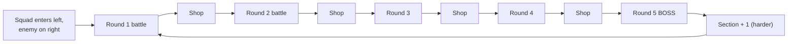
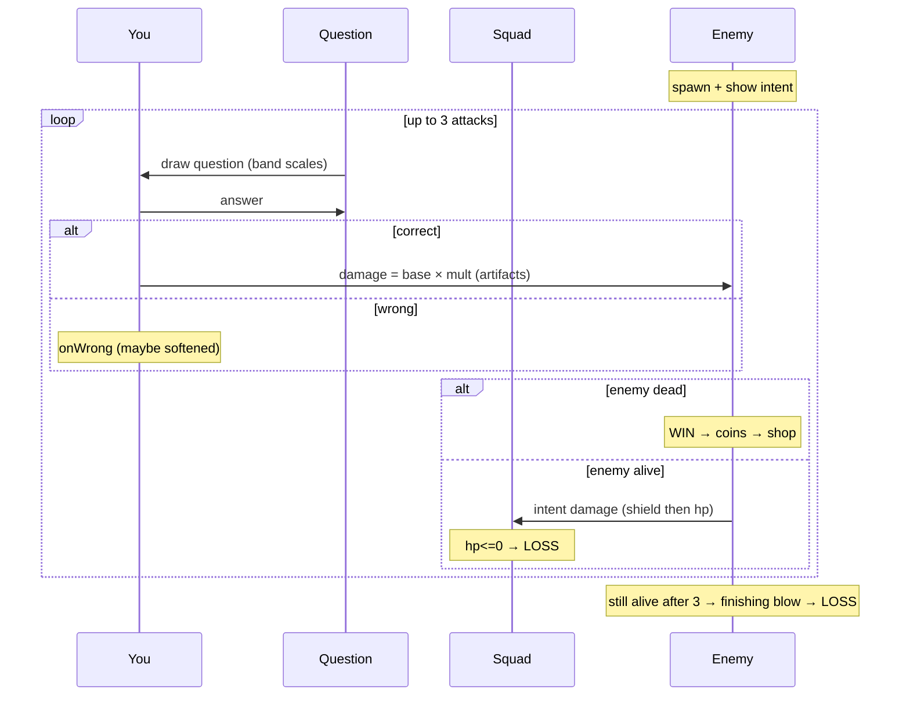

# 03 — KBB · Kuiper Belt Battle

<!-- doc-version: v1.4 · baseline v1.0 = original file · MINOR (V1.1 KBB#9 surge turns + KBB#10 salvage/hangar meta) -->
**Doc version:** v1.4 · **Owner:** single chat · **Edited:** 2026-07-12

**Genre:** 2D roguelike, Slay-the-Spire structure × Balatro scoring (Canvas, parallax). **Status:** new build (Phase 2). The biggest design surface — read this whole file before coding.

A squad of three NX-SRC ships chases the BCM warship into the Kuiper Belt. **You attack by answering exam questions.** The chase has a destination: the **BCM Flagship at section 3's boss** — kill it and the run is WON. Past it, the **Deep Belt** stays endless and escalating; what makes each run unique is the **artifacts** you collect and combine.

---

## 1. Run structure

- A **run** = a sequence of **sections**. Each section = **5 rounds: 4 battles + 1 boss.**
- **The arc (v1.3 / `v0.149.0`):** the section-3 boss is the **BCM FLAGSHIP · Sovereign** (`flagshipSection: 3` in CONFIG — identity only; HP/intent stay on the locked curves). Killing it sets `run.won`, emits `run_ended result:'win'`, lands phase `'won'`, and shows the gold VICTORY overlay: **Push into the Deep Belt ▸** (`claimVictory(run)` → the normal post-boss shop; section 4+ continues endless exactly as before) or **New run**. `profile.kbbWins` counts victories (one-shot per run); the G2 checkpoint carries `won`. A ~15-round winnable target = one strong study session.
- Endless past the win: section N+1 follows section N with higher enemy HP and harder questions.
- **Score = depth reached**, labeled `section-round` (e.g., `1-1` = first battle; `3-5` = the Flagship). Best depth persisted.



Shop appears after **every** battle (including before the boss). Lose at any battle → run ends → score = furthest `section-round` cleared+current.

---

## 2. The squad (✅ confirmed: shared entity, three named ships)

The squad reads as **three ships** but acts as **one entity** when attacking — a single shared HP+shield pool. Each ship is the *narrative home* of one stat, so artifacts are themed to a ship even though they all modify the one shared squad:

| Callsign (proposed) | Role | Stat it owns | Artifacts that route here |
|---------------------|------|--------------|---------------------------|
| **Talon** | DPS / Fighter | `basePower` (attack) | damage artifacts |
| **Aegis** | Shield | `block` per enemy turn + `maxShield` | durability artifacts |
| **Mender** | Medic | `healPower` (heal magnitude) | healing artifacts |

> Names are proposals (N4) — easy to rename. Flavor text references the ship ("Talon overcharges: ×2 damage"), but mechanically everything resolves on the shared `Squad`.

Squad state:
```ts
interface Squad {
  hp: number; maxHp: number;        // shared pool; 0 → run over
  shield: number;                    // temporary absorb, consumed before hp
  basePower: number;                 // Talon-owned attack base
  block: number;                     // Aegis grants this much shield each enemy turn
  healPower: number;                 // Mender-owned heal magnitude
  coins: number;
  artifacts: Artifact[];             // max 5 equipped
}
```

---

## 3. Battle: turn structure

Per your spec: **max 3 attacks** to defeat the enemy; the enemy **attacks back after each of your attacks**; failing to kill in 3 = loss; the enemy can also kill you during the 3 turns.

**Sequence of one battle:**
1. **Battle start.** Enemy spawns with `hp`, `maxHp`, and a visible **intent** (how much damage its next attack will deal). Fire `onBattleStart` artifact hooks. Shield ship may pre-load `shield += block`.
2. **Your attack (up to 3 times):**
   a. A question is drawn (`QuestionProvider.next`, difficulty band scales with section; exclude ids seen this battle).
   b. You answer.
   c. **Correct →** compute damage (see §4), apply to enemy. Fire `onCorrect`.
   **Wrong →** no damage by default. Fire `onWrong` (some artifacts soften: ignore first wrong, chip damage, etc.).
   d. If `enemy.hp <= 0` → **win** (skip remaining attacks).
3. **Enemy attack** (after each of your attacks, while enemy alive): damage = `enemy.intent` (modified by `onEnemyAttack` mitigation pipeline), absorbed by `shield` then `hp`. Re-roll/advance intent. If `hp <= 0` → **loss**.
4. After **3 attacks**, if enemy still alive → enemy delivers a **finishing blow** → loss.
5. **Win →** earn coins (`onCoinGain` pipeline), fire `onBattleWon`, go to shop.



---

## 4. Damage math (Q5: confirm — Balatro-style)

Recommended: **`damage = (basePower + Σ flatBonus) × (1 + Σ multBonus)`**, computed through an ordered pipeline so artifacts compose predictably.

```
ctx.flat = squad.basePower
ctx.mult = 1
for each artifact hook onCorrect / modifyDamage (in acquisition order):
    artifact may add to ctx.flat, add to ctx.mult, or transform ctx
damage = round(ctx.flat * ctx.mult)
clamp: finite, >= 0
```

Optional mult sources (Q5 — include speed/streak?):
- **Streak:** consecutive correct answers grant escalating mult (artifact-gated, off by default).
- **Speed:** answering under a threshold grants mult (artifact-gated, and must respect the "extra time" accessibility setting — so speed bonuses are opt-in, never punish slow readers by default).

Keeping base/mult explicit is what enables 50 artifacts to interact like Balatro jokers without spaghetti.

---

## 5. Enemy & boss design

```ts
interface Enemy {
  id: string; name: string;
  hp: number; maxHp: number;
  intent: number;            // damage of its next attack (shown to player)
  intentPattern: "flat" | "ramp" | "alternating" | "boss-special";
  rewardCoins: number;
}
```

- **Scaling:** `maxHp` grows with `section` and `round`; `intent` grows more slowly. Question **difficulty band** widens/rises with section (drawn via provider).
- **Boss (round 5):** higher HP + a special mechanic, e.g.: *shields up every other turn* (your alternate attacks blocked), *enrage* (intent ramps each turn), or *gated* (immune until you answer a difficulty-3 question correctly). One mechanic per boss, telegraphed.
- Defeating an enemy in **one** attack can trigger bonus artifacts (e.g., "Async Mirror").

**Checklist**
- [ ] Enemy/boss data + scaling curves (section/round → hp/intent/band)
- [ ] Intent display (number + icon, colorblind-safe)
- [ ] 3+ boss mechanics, one per boss, telegraphed
- [ ] One-shot detection for artifact triggers

---

## 6. Artifact system — the engine (most important part)

Target: **~50 unique artifacts**, max **5 equipped**. To keep them unique *and* bug-free, artifacts are **data + event hooks**, not bespoke code paths. The engine fires lifecycle events; each artifact subscribes and mutates context through **pipelines** (for value-modifying hooks) or **side effects** (for heal/shield/coins).

```ts
interface ArtifactCtx {
  run: RunState; section: number; round: number;
  squad: Squad; enemy: Enemy | null; question: Question | null;
  rng: Rng; log: (s: string) => void;
}

interface Artifact {
  id: string; name: string;
  rarity: "common" | "uncommon" | "rare" | "legendary";
  description: string;          // player-facing
  tags?: string[];              // e.g. "damage","heal","economy","storage"
  hooks: Partial<{
    onAcquire(c: ArtifactCtx): void;
    onRunStart(c: ArtifactCtx): void;
    onSectionStart(c: ArtifactCtx): void;
    onBattleStart(c: ArtifactCtx): void;
    onQuestionShown(c: ArtifactCtx): void;
    modifyDamage(c: ArtifactCtx, dmg: { flat: number; mult: number }): void; // pipeline
    onCorrect(c: ArtifactCtx): void;
    onWrong(c: ArtifactCtx): void;
    onAttackResolved(c: ArtifactCtx): void;
    modifyEnemyIntent(c: ArtifactCtx, intent: number): number;   // pipeline
    onEnemyAttack(c: ArtifactCtx, incoming: number): number;     // pipeline (mitigation)
    onBattleWon(c: ArtifactCtx): void;
    modifyCoinGain(c: ArtifactCtx, coins: number): number;       // pipeline
    onShopEnter(c: ArtifactCtx): void;
    onConsumableUsed(c: ArtifactCtx): void;
  }>;
}
```

**Engine rules:**
- Hooks fire in **acquisition order** (deterministic). `modify*` hooks form pipelines (output of one feeds the next). Document order in tooltips so combos are legible.
- All randomness via `ctx.rng` (seeded). No artifact reads wall-clock or `Math.random()`.
- Artifacts must be **pure w.r.t. their declared hooks** — no reaching into global state. This is what makes the fuzz test meaningful.

**Checklist (engine)**
- [ ] Event dispatcher with ordered pipelines + side-effect hooks
- [ ] Equip cap (5) + acquire/replace UX
- [ ] Deterministic ordering; all RNG via ctx.rng
- [ ] Tooltip generation from `description`

---

## 7. Artifact catalog — starter set (schema-defined; ~18 of 50)

The rest follow the same schema. Categories below are the design buckets to fill out to 50.

| id | name | rarity | effect (hook) |
|----|------|--------|---------------|
| `overclocked-core` | Overclocked Core | common | `+4` flat damage (`modifyDamage`) |
| `replication-factor` | Replication Factor | uncommon | `×1.5` mult while squad HP is full |
| `erasure-mult` | Erasure Multiplier | rare | `onCorrect`: `+0.5` mult, resets each battle |
| `nanobot-swarm` | Nanobot Swarm | common | `onCorrect`: heal `6` (scales with healPower) |
| `adaptive-shielding` | Adaptive Shielding | common | `onBattleStart`/enemy turn: `+8` shield |
| `data-locality` | Data Locality | uncommon | Storage-domain correct answers deal `×2` |
| `cold-tier` | Cold Tier | uncommon | first wrong answer each battle: no penalty |
| `curator` | Curator | common | `modifyCoinGain`: `+3` per battle |
| `lazarus-protocol` | Lazarus Protocol | rare | once per run, survive lethal at `1` HP |
| `compression` | Compression | uncommon | shop prices `−20%` |
| `prism-beam` | Prism Beam | rare | first attack each battle: `+1` attack this battle |
| `witness-daemon` | Witness Daemon | uncommon | `onQuestionShown`: reveal one wrong option |
| `metadata-ring` | Metadata Ring | legendary | `+0.2` mult **per artifact owned** |
| `foundation` | Foundation | uncommon | `onBattleWon`: `+2` max HP (permanent) |
| `genesis-block` | Genesis Block | rare | `onSectionStart`: `+1` basePower (permanent) |
| `risky-recompile` | Risky Recompile | rare | `−1` max attacks, but `×2` all damage |
| `async-mirror` | Async Mirror | uncommon | if enemy dies in 1 attack: gain a random consumable |
| `ntp-sync` | NTP Sync | common | `+6s` on question timers (if timers enabled) |

**Categories to reach ~50** (each ~5–8 artifacts):
- **Damage** (flat / mult / conditional)
- **Sustain** (Medic synergies: heal on correct/kill/section)
- **Defense** (Shield synergies: block, shield overflow, damage reflection)
- **Economy** (coins, discounts, reroll, interest on saved coins)
- **Question utility** (50/50, reveal, retry, extra attack, more time)
- **Risk/reward** (trade attacks/HP for damage/coins)
- **Scaling/"snowball"** (grow permanently over the run)
- **Domain-flavored** (bonus tied to a specific exam domain — also nudges learning that domain)

**Checklist (catalog)**
- [ ] Author ~50 artifacts as data across the 8 categories
- [ ] Each: id/name/rarity/description/hooks; reviewed for uniqueness
- [ ] Rarity-weighted shop pool
- [ ] Per-artifact unit test (effect fires as described)

---

## 8. Shop & consumables

- Appears after each battle. Offers **rarity-weighted artifacts** + **consumables**, plus a **reroll** (coins).
- **Artifacts:** buy to equip (cap 5; replacing one is allowed with confirm).
- **Consumables (one-shot):** `repair` (heal HP), `recharge` (restore shield), maybe `purge` (skip/redraw a question once), `intel` (preview next enemy intent). Artifacts can modify consumable strength.
- Coins from battle wins (`modifyCoinGain` pipeline); boss pays more.

**Checklist**
- [ ] Shop UI (offers + prices + reroll + buy/replace)
- [ ] Consumable set + effects + inventory
- [ ] Rarity weighting + price scaling by section
- [ ] Coin economy tuned (see review-agent fuzz/balance pass)

---

## 9. Difficulty & question integration

- Question **difficulty band** rises with section (provider `difficultyBand` widens upward).
- Enemy `maxHp` and boss mechanics escalate per section/round.
- All questions **randomized** within the band; exclude ids already seen **this battle** (across-run repeats are fine and feed mastery).
- Every answer → `MasteryStore.record` + telemetry `question_answered`.

---

## 10. Determinism, save & scoring

- A run is driven by a **seed** (RNG). Same seed + same answers ⇒ same run (critical for the fuzz suite and for debugging).
- **Save:** persist best depth (`section-round`), and optionally allow run resume (seed + state snapshot) — resume is a stretch goal.
- **Score:** encode `section-round` to a comparable number for leaderboards (e.g., `section*100 + round`).

---

## 11. Verification (KBB-specific)

Beyond the shared gate:
- [ ] **Unit test per artifact** — effect matches description, no exceptions.
- [ ] **Battle-engine tests** — win/loss paths, 3-attack cap, enemy-during-turns death, shield-before-HP, finishing blow.
- [ ] **Pipeline order tests** — `modifyDamage`/`modifyCoinGain`/`onEnemyAttack` compose in acquisition order.
- [ ] **Fuzz suite (the big one)** — run e.g. **500 seeded runs**, each picking random artifacts and answering randomly, asserting invariants every step:
  - `0 ≤ hp ≤ maxHp`, `shield ≥ 0`, `coins ≥ 0`
  - `damage` finite and `≥ 0` (no `NaN`/`Infinity`)
  - no thrown exceptions; every run terminates (win-section or loss)
  - artifact cap never exceeded
  This is the primary defense against artifact-interaction bugs.
- [ ] **Balance report** from fuzz output (avg depth, coin curve, win rates) feeds tuning.

---

## 12. KBB checklist (rollup)

**Engine**
- [ ] Run/section/round state machine (4 battles + boss, endless)
- [ ] Battle turn loop (3-attack cap, enemy counter-attacks, loss paths)
- [ ] Damage pipeline (base × mult) + clamping
- [ ] Squad model (HP + shield + role stats) [Q6]
- [ ] Enemy/boss scaling + boss mechanics

**Artifacts & shop**
- [ ] Hook dispatcher + ordered pipelines
- [ ] ~50 artifacts authored as data (8 categories)
- [ ] Equip cap (5), shop, reroll, consumables, coin economy

**Integration**
- [ ] QuestionProvider band scaling + per-battle exclusions
- [ ] MasteryStore + telemetry on every answer
- [ ] Seeded RNG throughout; depth scoring + persistence

**Verification**
- [ ] Per-artifact unit tests
- [ ] Battle/pipeline tests
- [ ] 500-run fuzz invariants green
- [ ] Balance report generated


---

## 13. View rebuild + rendering (added v1.1 — matches shipped `kbb.js`)

The battle view was rebuilt as a **four-zone CSS grid** (non-overlap guaranteed by the grid, not by absolute positioning):
- a **head** row (turn / run status pill);
- a **green** column — the NX-SRC squad;
- a **center** — the combat canvas (3D / 2D);
- an **enemy** column — the BCM warship + its **"Incoming Attack"** intent (a pulsing alert label);
- a **quest** row — the question / shop panel.

**Combat rendering** is a Three.js path with a 2D-canvas fallback. The 3D path expects sprite assets `kbbHero1/2/3` (squad), `kbbEnemy`, `kbbBoss`, and `kbbAsteroid1-5`, over a parallax **`nebulaBg`** backdrop. **Those `kbb*` sprite keys are not yet inlined into `STARNIX_ASSETS`** (only `nebulaBg` and the legacy `bcmShip` are present), so the build currently renders on the **2D fallback** until Core inlines them; the 3D code path is ready.

`pause()` / `resume()` are implemented (hard freeze; per `01 §9`). Verified by the jsdom suite (81/81) + a 200-run fuzz + a 14/14 draw-loop check. **Browser-blind:** pixel-level zone non-overlap at real sizes, the WebGL 3D path, and visual correctness (the 2D fallback is what currently ships).

---

## 14. Agency, tune, cinematic, telegraphs, boss music, harness (added v1.2 — matches shipped `kbb.js`)

**Pre-answer agency (`v0.46.0`, K5).** Every question offers **⚔ Attack / 🛡 Brace (+block) / ✚ Repair (+heal)** before answering. A **correct** answer executes the chosen action; a **wrong** answer does nothing (the enemy still counters, the turn still counts). Engine seam: `submitAnswer(run, answer, answerMs, action)` — the 4th arg omitted = `attack`, so all earlier callers are unchanged.

**Combat re-tune (`v0.46.0`, K4).** `basePower` 10→**12**, `healPower` 7→**10**, intents 3/0.5→**2.5/0.35**. The fuzzed killer was the **finishing-blow kill window** (r5 bosses needed 3 hits inside it), not chip damage; eager defense fuzzes *worse* than answer-only (it burns the window), so emergency-only defense is the policy. **Accepted divergence:** `maxAttacks` = **5** vs this spec's original 3 — kept, with the fuzz gate locked around it (`KBB_ASSERT=1 node kbb-balance.cjs`, wired into `npm run check`): 70%/random median ≥3, 50% median ≤2, 85%/good cap-reach ≤50%. The combat row sits at equal **4fr** grid weight (K2).

**Opening cinematic (`v0.48.0`).** Four beats, 7.2 s, skippable: squad **warp-in** (streaks resolve to ships) → radar sweep + pulsing contact blip → the warship **decloaks** (scanline shimmer) and fires a **warning shot across the bow** (near-miss flash, squad jink) → it flips and **burns away** under a 6% zoom. Reduced motion: 3.2 s, no zoom/shimmer/jink.

**Turn-flow intuitiveness (`v0.48.0`).** An action-hint line under the action row ("Correct fires your action · Wrong = the enemy strikes free"); the enemy panel **strikes** (`kbb-en-strike` peach flash-ring) when its counterattack lands, clearing with the fresh question; a pulsing **FINAL ATTACK** statline on attack N/N (makes the kill window legible); **impact shake** on the combat canvas (CSS transform: hull 0.45 / shield-only 0.2 / reduced 0).

**Boss music (`v0.50.0`).** `renderEnemy` owns a transition-guarded bed switch: a live boss battle plays the fixed `boss` track with the intensity layer; any non-boss render returns to the `kbb` context bed. Guard `s._musicCtx` (seeded at mount) so playlist rotation only advances on real switches. Placement note: the normal per-turn path (`afterAnswer`) never calls `renderAll`, so the hook lives where every path crosses.

**Harness (`v0.50.0`).** `kbb-headless.cjs` + `kbb-run.cjs` rebuilt (the repo never had them): engine layer asserts per-turn invariants (hp/shield bounds, `attackIndex ≤ maxAttacks`, wrong = no damage), **real-state** brace/repair (counterattack accounted), and an all-wrong run to `phase=lost` with `lossReason ∈ {enemy-kill, finishing-blow}`; DOM layer drives how-to → cinematic skip → Start run → answered turns crossing battles via the shop, the strike telegraph, the boss-music swap + return, and clean unmount. `kbb-draw.cjs` runs again under real node-canvas. Both are in `npm run check`.

## 15. Unknown-stop event deck (v1.3 · `v0.133.0`, closes the D6 open call)

Each `?` corridor stop carries **one pre-rolled event** (rolled in `genMap` from the map's view-side rng fork, stored on the stop — deterministic per seed, checkpoint-safe because the G2 snapshot deep-copies `run.map`). The resolver `applyStopEvent(run, ev)` lives in the ENGINE next to `claimCache`; every applier is log-honest and never lethal:

| roll | event | effect |
|---|---|---|
| < 0.35 | **Salvage cache** | +12–25 coins |
| < 0.65 | **Supply drop** | a random consumable (hold full → scrapped for +10 coins, said out loud) |
| < 0.85 | **Field repair** | +6–10 HP (capped at maxHp) |
| else | **Risky salvage** (gamble) | 50/50: +30 coins, or −4 HP floored at 1 HP |

Legacy saved maps that carry bare `coins` on a stop still resolve as a cache. Weights live in the `genMap` roll (kbb.js), not CONFIG — move them if they ever need tuning.

## 16. Post-battle debrief (v1.3 · `v0.140.0`)

`submitAnswer`'s wrong branch collects up to **5 misses per battle** on `run.misses` (reset by `startBattle`) as **view-ready text resolved against the shuffled presentation** — stem, right answer(s), first-line explanation clip. `renderMap` shows them in a collapsible gold `Debrief · N missed` card between the header and the corridor. Transient by design (not checkpointed).

## §17 — Surge turns & the Hangar (v1.4)

- **Surge turns (`v0.192.0`, V1.1 KBB#9).** `battle.energy/maxEnergy` is real state (the gem reads it).
  A 3-correct streak charges a SURGE; the next correct answer is worth TWO actions (`surgeOpen` →
  `surgeAction()`), with the enemy counter HELD until the turn's final action (`finishTurn` runs
  exactly once per turn). A whole surge costs one attack-window slot. Rare artifact **Twin Reactor**
  charges at a 2-streak. Wrong answers still do nothing; a charged surge waits for a correct.
- **Salvage & the Hangar (`v0.201.0`, V1.1 KBB#10).** Run end (loss OR flagship win) banks
  `round(coinsEarned × 10%)` to `profile.kbbSalvage` via `persistence.update` (live profile).
  The lost-card HANGAR spends it on three ONE-TIME unlocks (bounded 155 sink): a chosen **common**
  starting artifact (60), +5 starting max HP (45), a fifth consumable slot (50). Fittings ride
  `ctx.hangar` (a core-provided profile snapshot) and apply inside `createRun` — never a revived
  pre-run shop (the v0.68 J6 restart ruling holds), so fresh starts and restarts both wear them.
- **Persistence schema:** `profile.kbbSalvage` (number), `profile.kbbHangar` `{artifact?, hp?, slot?}` —
  defaulted in `defaultProfile`/`migrate` (core).

## Change history

- **v1.4 (2026-07-12)** — New §17: KBB#9 surge turns (energy real, held-counter ordering, Twin Reactor) and KBB#10 salvage + hangar meta-progression (10% run-end banking, three capped unlocks as createRun opts, persistence schema). Balance re-verified against the locked fuzz targets both times.

- **v1.3 (2026-07-11)** — §1 gains the run ARC: the section-3 boss is the named **BCM Flagship** — victory beat (`run.won`, phase `'won'`, gold overlay, `run_ended result:'win'`, `profile.kbbWins`, checkpoint-carried) then the optional endless **Deep Belt** via `claimVictory` (`v0.149.0`). New §15: the unknown-stop **event deck** (`v0.133.0` — cache/supply/repair/gamble, engine resolver, pre-rolled + checkpoint-safe). New §16: the post-battle **debrief** card (`v0.140.0`). Balance curves untouched.

- **v1.2 (2026-06-28)** — Added §14: `v0.46` pre-answer agency (Attack/Brace/Repair via `submitAnswer`'s 4th arg) + combat re-tune (basePower 12, healPower 10, intents 2.5/0.35; the kill-window root cause; **accepted `maxAttacks` 5-vs-spec-3 divergence**; fuzz gate targets in `npm run check`), the `v0.48` four-beat cinematic + intuitiveness pass (hint line, `kbb-en-strike` telegraph, FINAL ATTACK statline, impact shake), the `v0.50` boss-music bed switch in `renderEnemy`, and the rebuilt `kbb-headless.cjs`/`kbb-run.cjs` harness pair + revived `kbb-draw.cjs`. No question-bank change.

- **v1.1 (2026-06-28)** — Added §13 documenting the v0.2.0 **view rebuild**: a four-zone CSS grid (head / green squad / center combat canvas / enemy column with a pulsing "Incoming Attack" intent / quest row), a Three.js 3D combat path with a 2D-canvas fallback, and a parallax `nebulaBg` backdrop. Noted that the `kbb*` 3D sprite keys (`kbbHero1/2/3`, `kbbEnemy`, `kbbBoss`, `kbbAsteroid1-5`) are **not yet inlined** into `STARNIX_ASSETS`, so the build runs on the 2D fallback for now. `pause()`/`resume()` implemented. Verified 81/81 jsdom + 200-run fuzz + 14/14 draw-loop (structural; the 3D/visual layer is browser-blind). No design or question-bank change.
- **v1.0** — baseline (original `03_KBB_kuiper_belt_battle.md`): the full KBB design (run structure, squad, battle/damage, enemies/boss, artifact engine + catalog, shop, difficulty, determinism/scoring, verification).
